---
## Front matter
title: "Внешний курс. Блок 2: Защита ПК/Телефона"
subtitle: "Основы информационной безопасности"
author: "Кузьмин Егор Витальевич"
## Generic otions
lang: ru-RU
toc-title: "Содержание"

## Bibliography
bibliography: bib/cite.bib
csl: pandoc/csl/gost-r-7-0-5-2008-numeric.csl

## Pdf output format
toc: true # Table of contents
toc-depth: 2
lof: true # List of figures
lot: true # List of tables
fontsize: 12pt
linestretch: 1.5
papersize: a4
documentclass: scrreprt
## I18n polyglossia
polyglossia-lang:
  name: russian
  options:
	- spelling=modern
	- babelshorthands=true
polyglossia-otherlangs:
  name: english
## I18n babel
babel-lang: russian
babel-otherlangs: english
## Fonts
mainfont: PT Serif
romanfont: PT Serif
sansfont: PT Sans
monofont: PT Mono
mainfontoptions: Ligatures=TeX
romanfontoptions: Ligatures=TeX
sansfontoptions: Ligatures=TeX,Scale=MatchLowercase
monofontoptions: Scale=MatchLowercase,Scale=0.9
## Biblatex
biblatex: true
biblio-style: "gost-numeric"
biblatexoptions:
  - parentracker=true
  - backend=biber
  - hyperref=auto
  - language=auto
  - autolang=other*
  - citestyle=gost-numeric
## Pandoc-crossref LaTeX customization
figureTitle: "Рис."
tableTitle: "Таблица"
listingTitle: "Листинг"
lofTitle: "Список иллюстраций"
lotTitle: "Список таблиц"
lolTitle: "Листинги"
## Misc options
indent: true
header-includes:
  - \usepackage{indentfirst}
  - \usepackage{float} # keep figures where there are in the text
  - \floatplacement{figure}{H} # keep figures where there are in the text
---

# Цель работы

Пройти второй блок курса "Основы кибербезопасности"

# Выполнение блока 2: Защита ПК/Телефона

## Шифрование диска

Шифрование диска — технология защиты информации, переводящая данные на диске в нечитаемый код, который нелегальный пользователь не сможет легко расшифровать. Соответственно, можно (рис. 1).

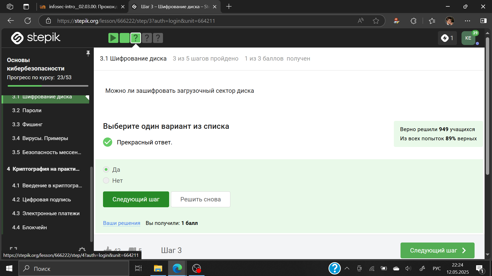{#fig:001 width=70%}

Шифрование диска основано на симметричном шифровании (рис. [2).

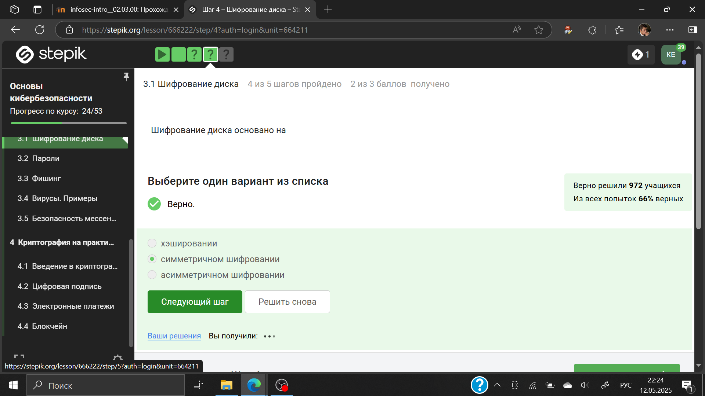{#fig:002 width=70%}

Отмечены программы, с помощью которых можно зашифровать жетский диск (рис. 3).

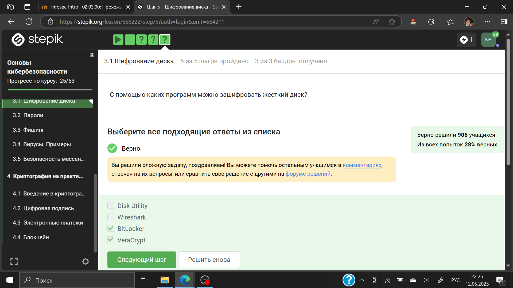{#fig:003 width=70%}

## Пароли

Стойкий пароль - тот, который тяжлее подобрать, он должен быть со спец. символами и длинный (рис. 4).

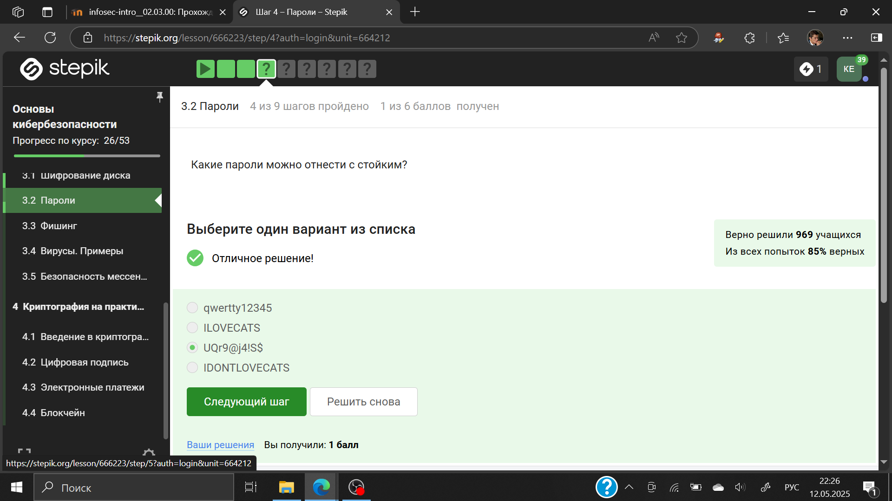{#fig:004 width=70%}

Все варианты, кроме менеджера паролей, совершенно не надежные (рис. 5).

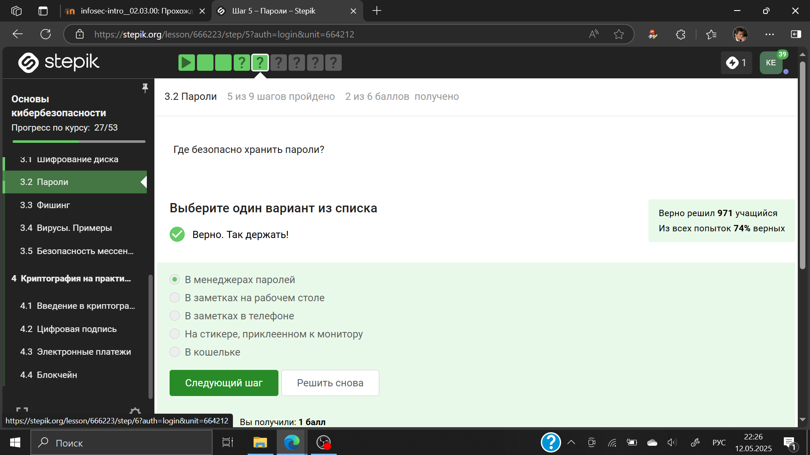{#fig:005 width=70%}

Капча нужна для проверки на то, что за экраном "не робот"(рис. 6).

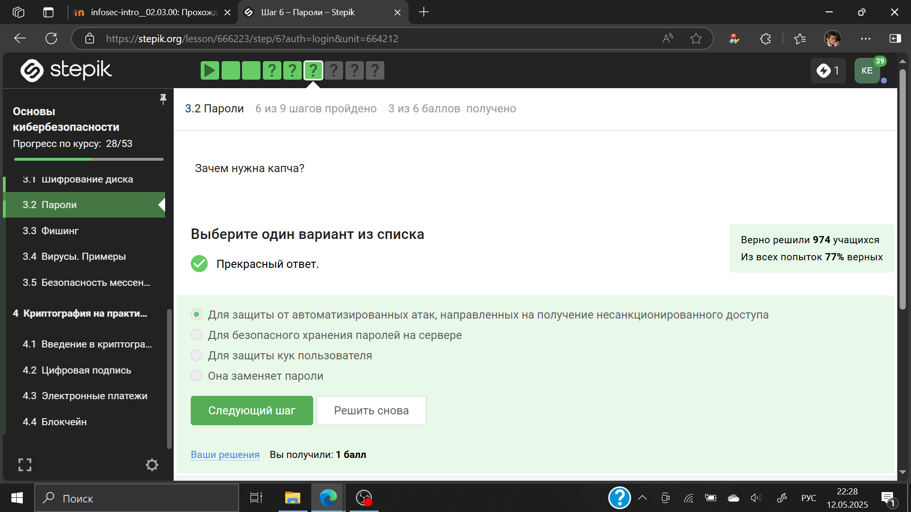{#fig:006 width=70%}

Опасно хранить пароли в открытом виде, поэтому хранят их хэши (рис. 7).

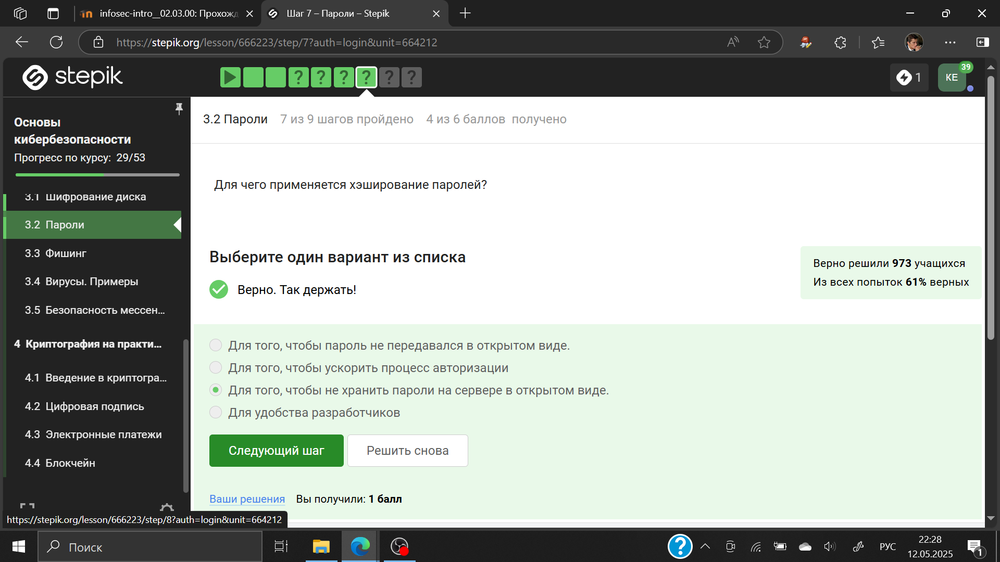{#fig:007 width=70%}

Соль не поможет (рис. 8).

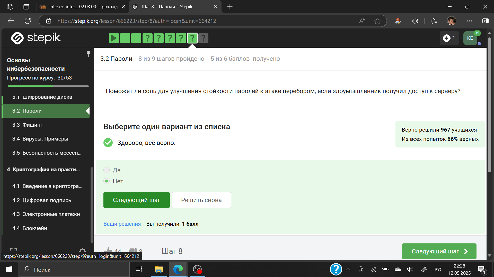{#fig:008 width=70%}

Все приведенные меры защищают от утечек данных (рис. 9).

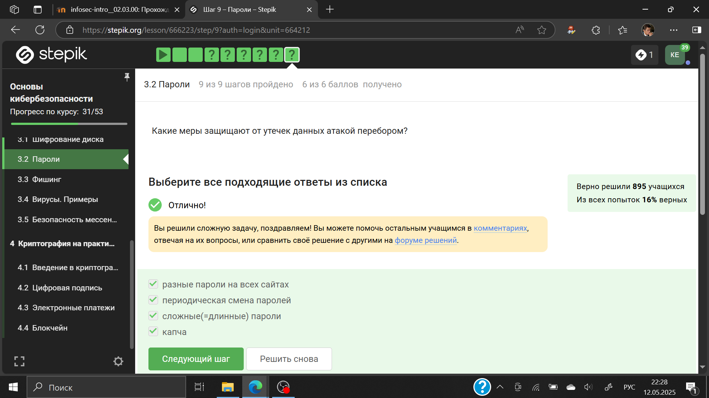{#fig:009 width=70%}

## Фишинг

Фишинговые ссылки очень похожи на ссылки известных сервисов, но с некоторыми отличиями (рис. 10).

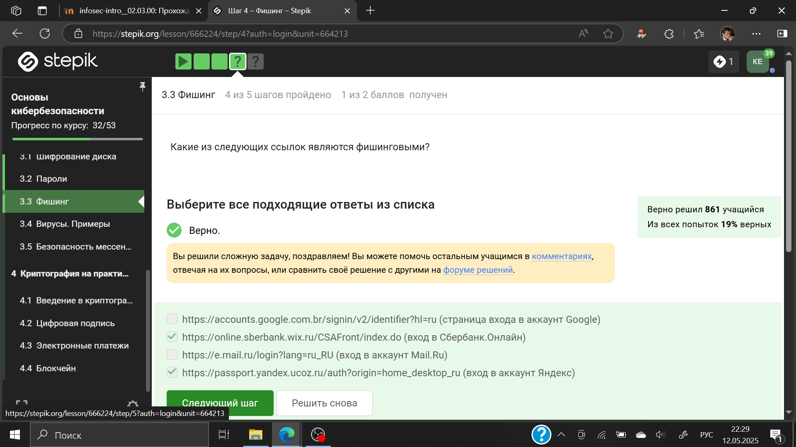{#fig:010 width=70%}

Да, может, например, если пользователя со знакомым адресом взломали (рис. 11).

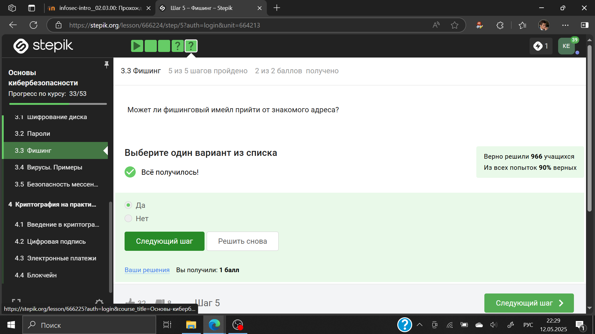{#fig:011 width=70%}

## Вирусы. Примеры

Ответ дан в соответствии с определением (рис. 12).

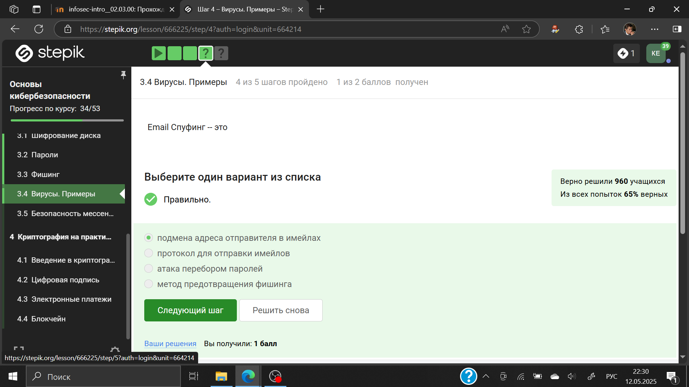{#fig:012 width=70%}

Троян маскируется под обычную программу (рис. 13).

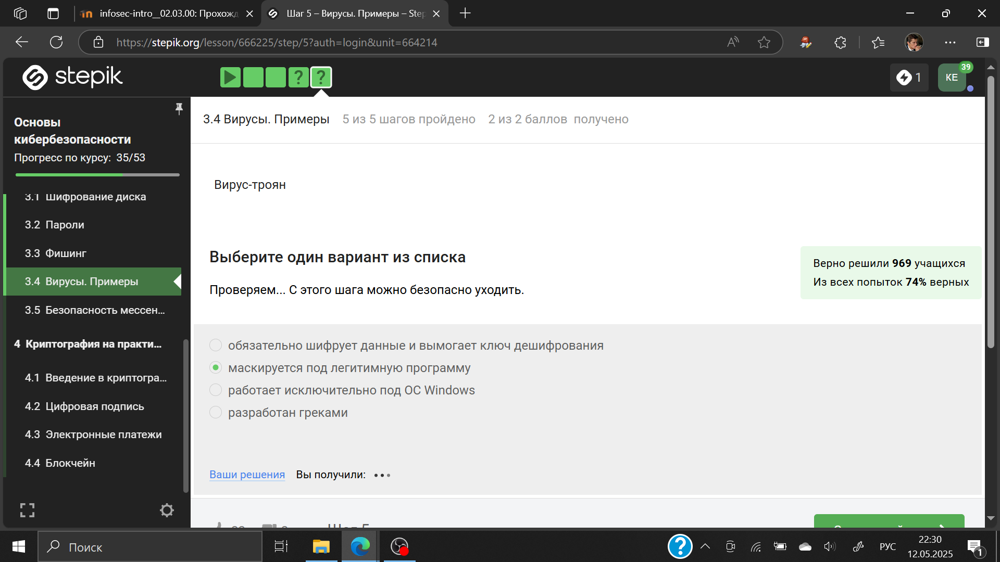{#fig:013 width=70%}

## Безопасность мессенджеров

При установке первого сообщения отправителем формируется ключ шифрования (рис. 14).

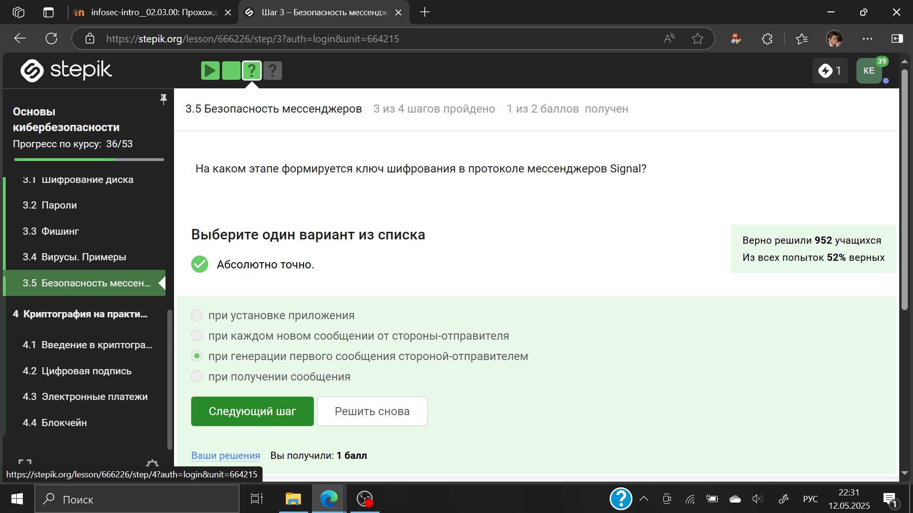{#fig:014 width=70%}

Суть сквозного шифрования состоит в том, что сообзения передаются по узлам связи в зашифрованном виде (рис. 15).

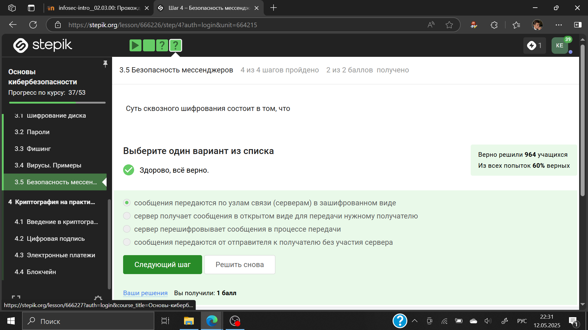{#fig:015 width=70%}

# Выводы

Был пройден второй блок курса "Основы кибербезопасности", изучены правила хранения паролей и основная информация о вирусах
