---
## Front matter
lang: ru-RU
title: Презентация по лабораторной работе №1
subtitle: Основы информационной безопасности
author:
  - Кузьмин Егор Витальевич
institute:
  - Российский университет дружбы народов, Москва, Россия
date: 22 февраля 2025 года

## i18n babel
babel-lang: russian
babel-otherlangs: english

## Fonts
mainfont: PT Serif
romanfont: PT Serif
sansfont: PT Sans
monofont: PT Mono
mainfontoptions: Ligatures=TeX
romanfontoptions: Ligatures=TeX
sansfontoptions: Ligatures=TeX,Scale=MatchLowercase
monofontoptions: Scale=MatchLowercase,Scale=0.9

## Formatting pdf
toc: false
toc-title: Содержание
slide_level: 2
aspectratio: 169
section-titles: true
theme: metropolis
header-includes:
 - \metroset{progressbar=frametitle,sectionpage=progressbar,numbering=fraction}
 - '\makeatletter'
 - '\beamer@ignorenonframefalse'
 - '\makeatother'
---

# Информация

## Докладчик

:::::::::::::: {.columns align=center}
::: {.column width="70%"}

  1. Кузьмин Егор Витальеви
  2. Группа НКАбд-01-23
  3. Российский университет дружбы народов

:::
::: {.column width="30%"}

## Цель

Целью данной работы является приобретение практических навыков
установки операционной системы на виртуальную машину, настройки минимально необходимых для дальнейшей работы сервисов.

## Задание

1. Установка и настройка операционной системы.
2. Найти следующую информацию:
	1. Версия ядра Linux (Linux version).
	2. Частота процессора (Detected Mhz processor).
	3. Модель процессора (CPU0).
	4. Объем доступной оперативной памяти (Memory available).
	5. Тип обнаруженного гипервизора (Hypervisor detected).
	6. Тип файловой системы корневого раздела.

## Выполнение лабораторной работы

Т.к. у меня уже скачен образ системы "Роки" и установлен "Виртуал Бокс", следовательно, я создаю новую виртуальную машину, выбираю имя, местоположение  и образ ISO 

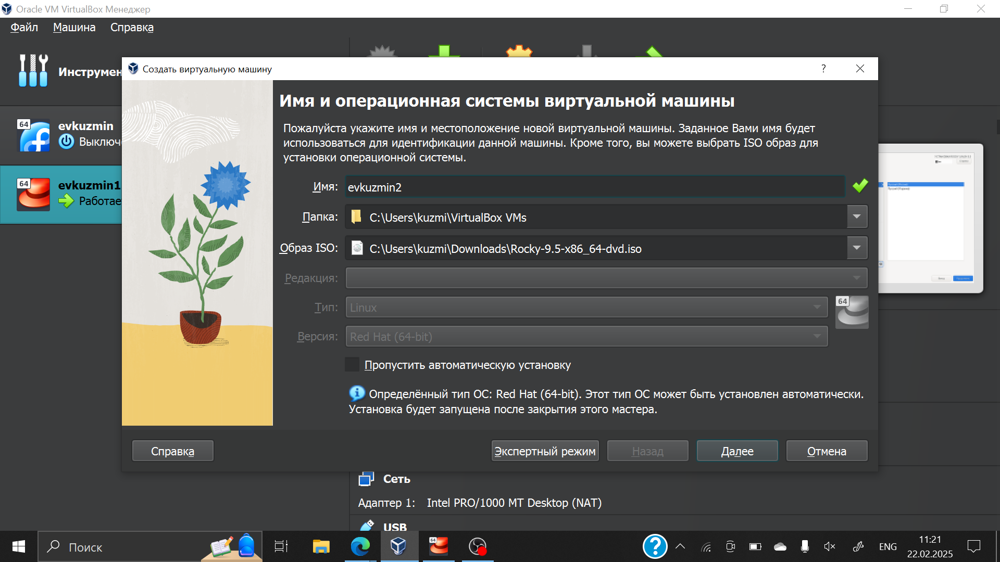{#fig:001 width=70%}

## Какие получились итоги после шагов настройки

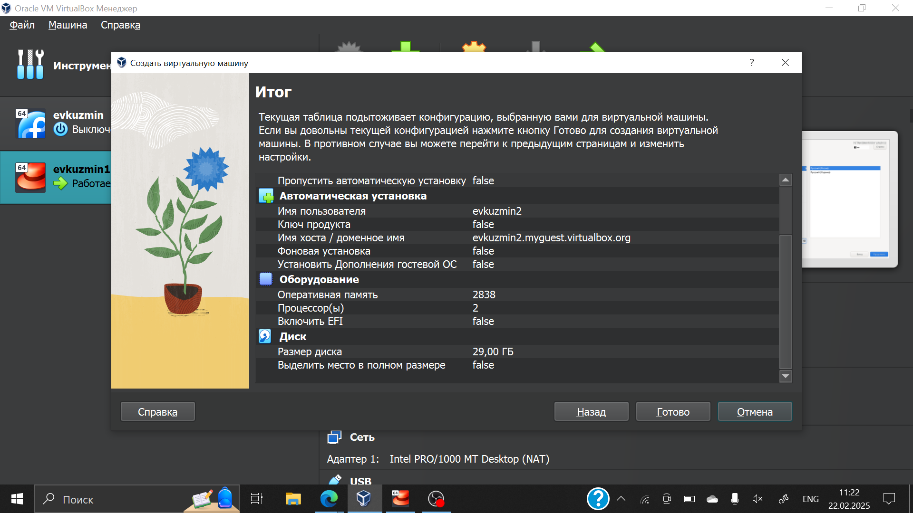{#fig:002 width=70%}

## Обязательно нужно подключить образ диска, так как без него ничего не выйдет

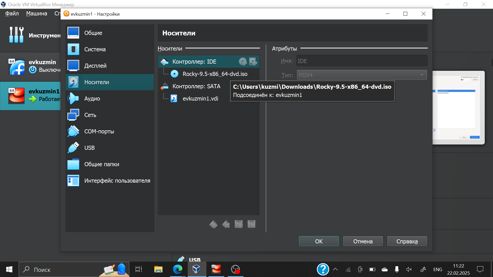{#fig:003 width=70%}

## Обзор установки

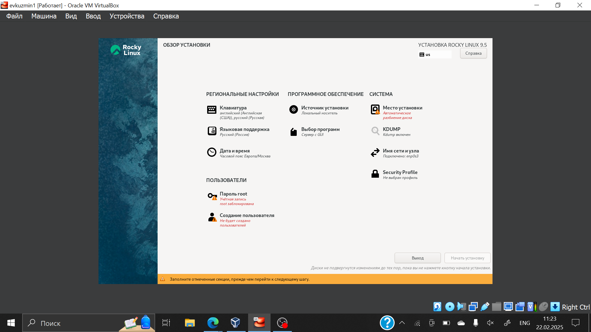{#fig:004 width=70%}

## Ход установки 

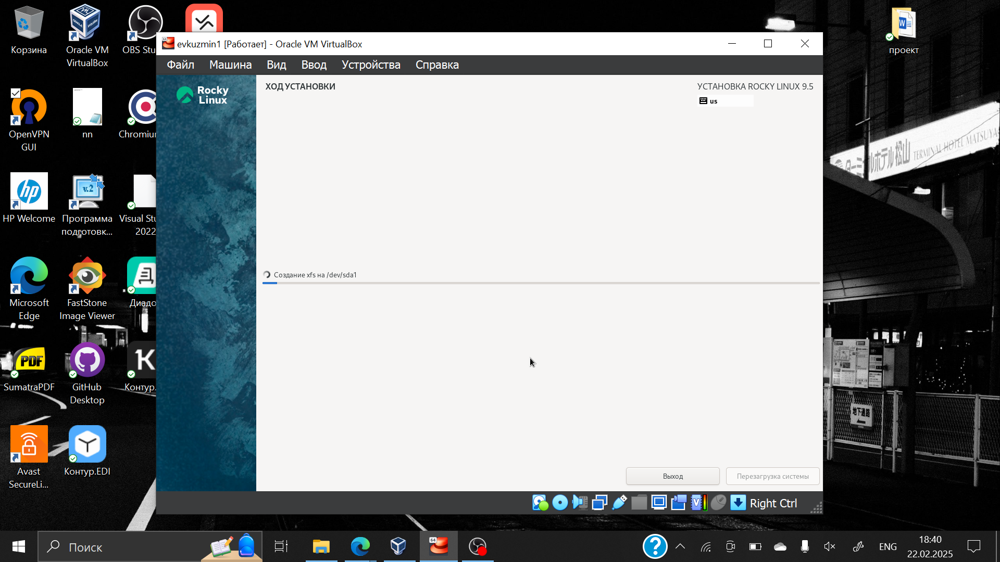{#fig:005 width=70%}

## После завершения установки образ диска становится пустым

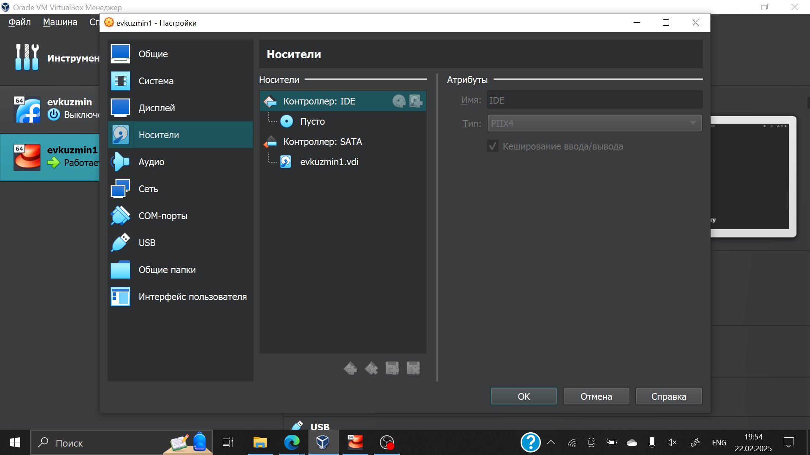{#fig:006 width=70%}

## Окно выбора пользователя 

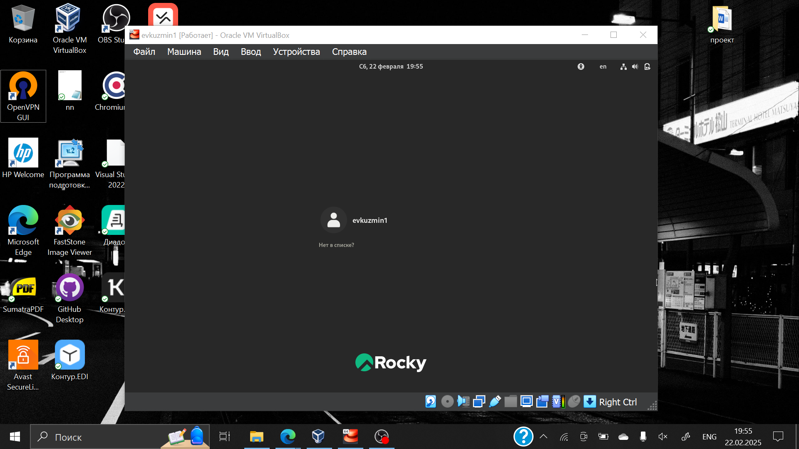{#fig:007 width=70%}

# Выполнение дополнительного задания

## 1

Открываю терминал, в нем прописываю dmesg | less 

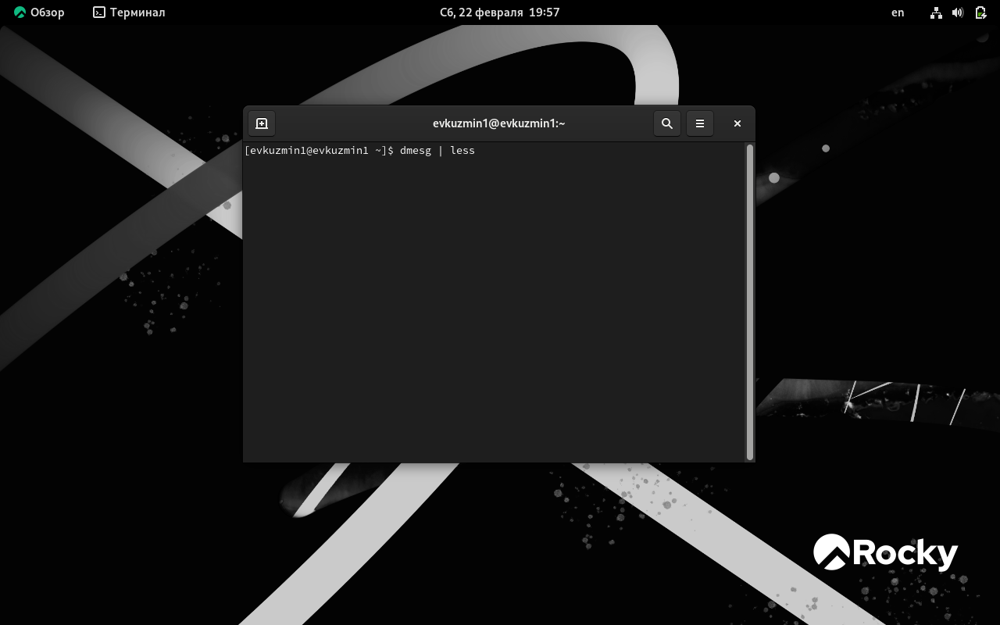{#fig:008 width=70%}

## 2

Версия ядра 

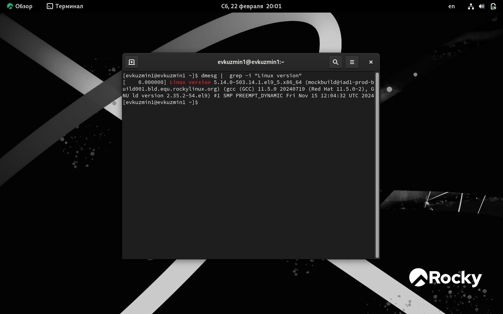{#fig:009 width=70%}

## 3

Частота процессора 

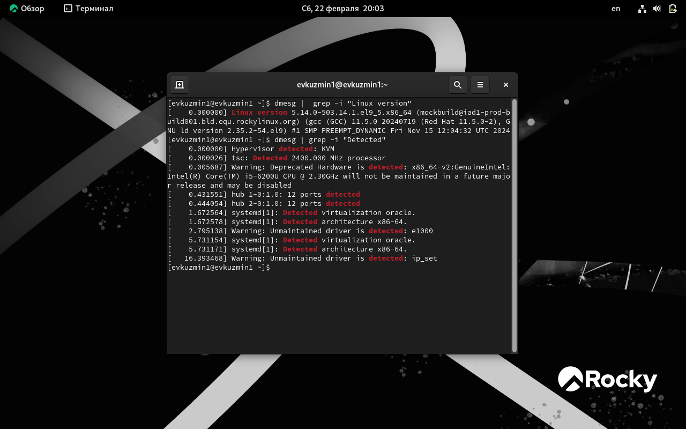{#fig:010 width=70%}

## 4

Модель процессора 

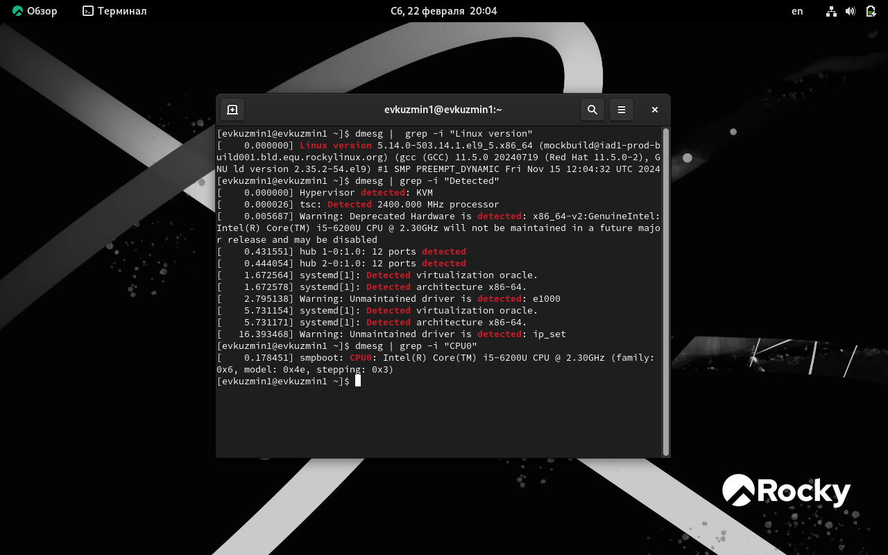{#fig:011 width=70%}

## 5

Доступно памяти

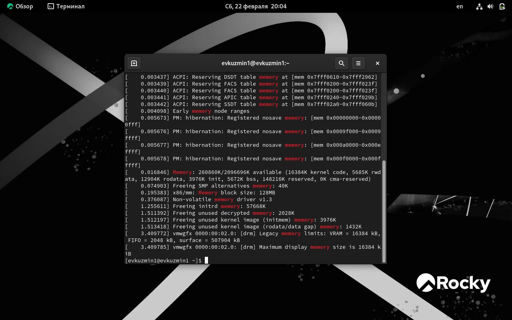{#fig:012 width=70%}

## 6

Гипервизор

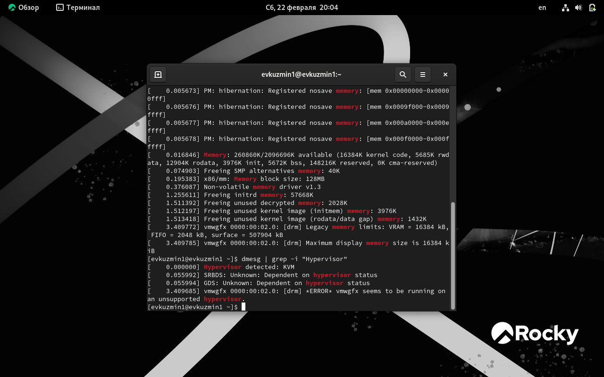{#fig:013 width=70%}

## 7

sudo fdish -l показывает тип файловой системы, типа Linux, Linux LVM 

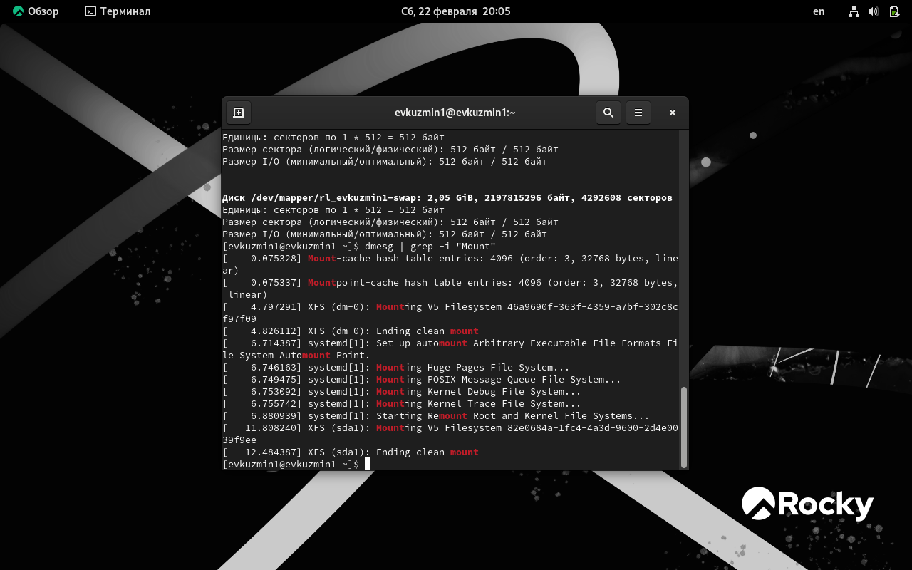{#fig:014 width=70%}

## 8

Далее показана последовательно монтирования файловых систем 

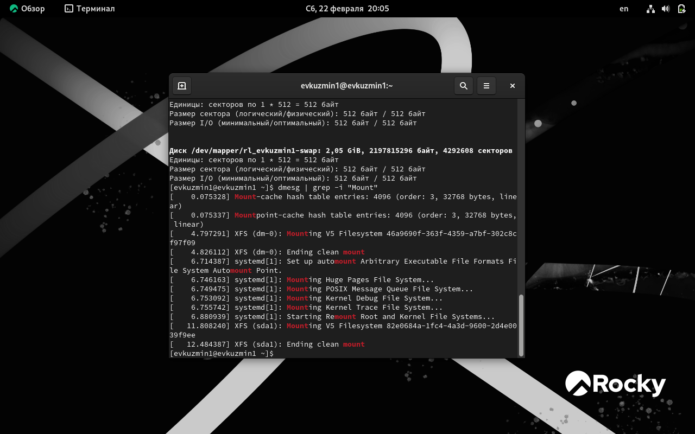{#fig:015 width=70%}

## Вывод

Я выполнил лабораторную работу в соответствии с требованиями

:::

