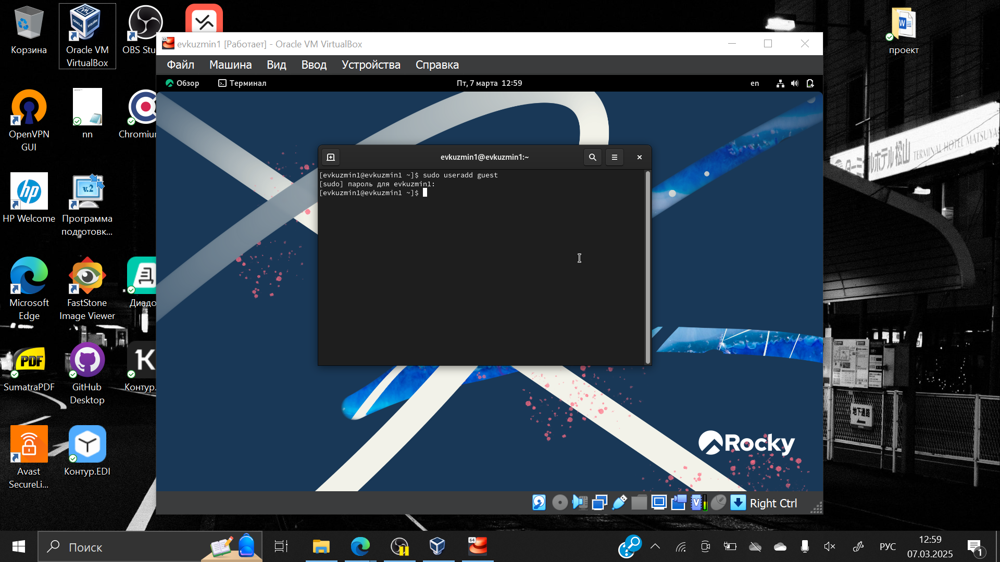
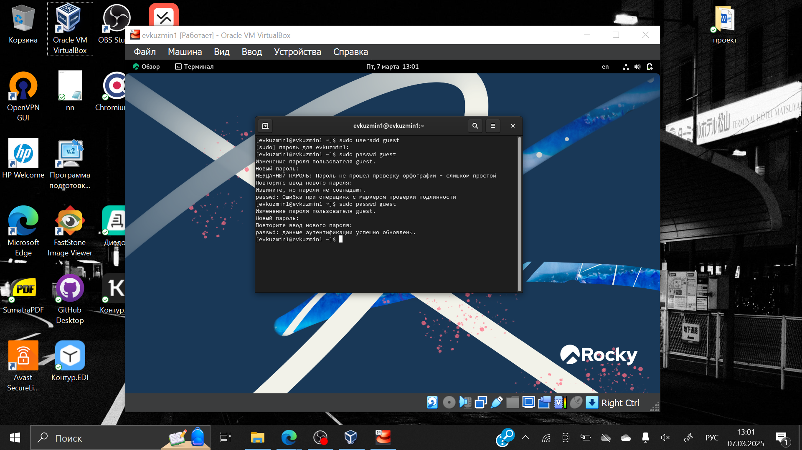
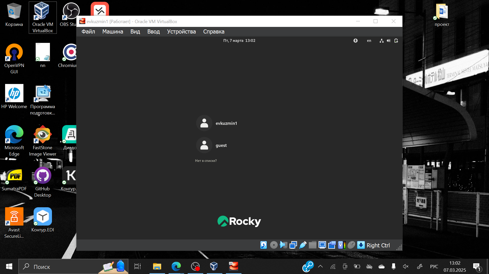
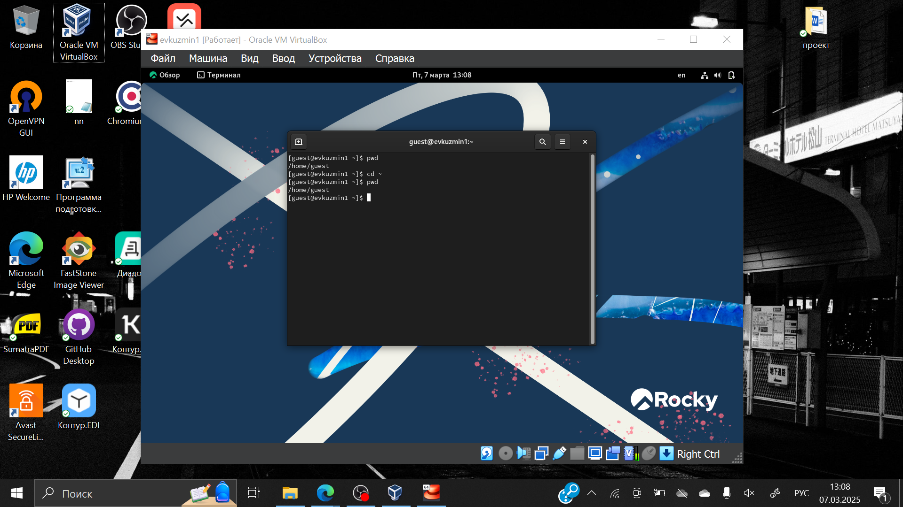
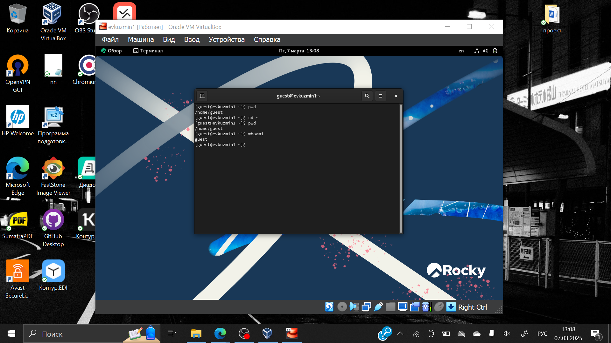
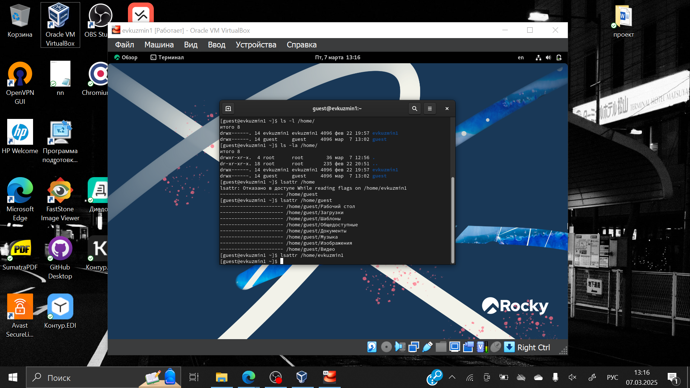
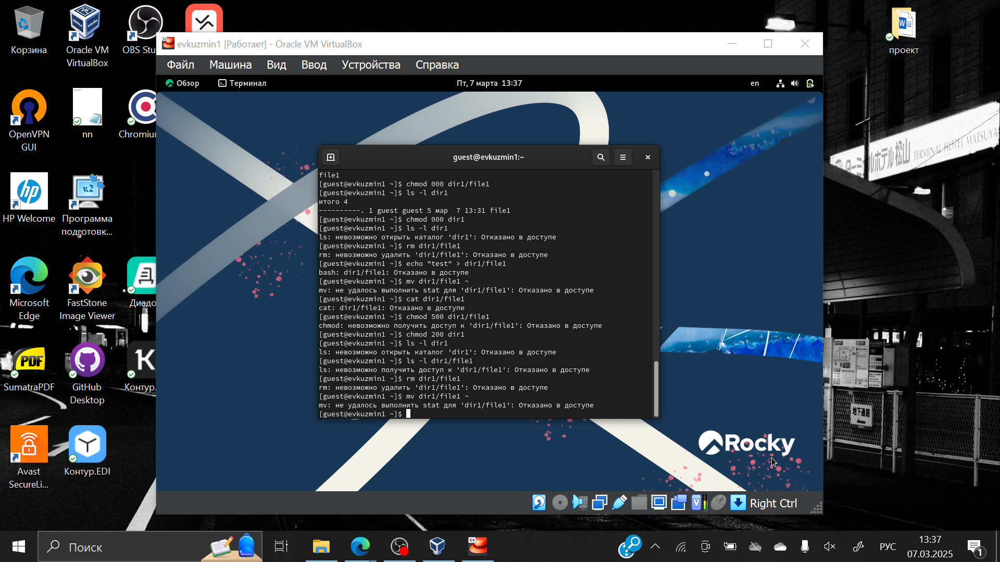

---
## Front matter
lang: ru-RU
title: Презентация по лабораторной работе №2
subtitle: Основы информационной безопасности
author:
  - Кузьмин Егор Витальевич
institute:
  - Российский университет дружбы народов, Москва, Россия
date: 07 марта 2025

## i18n babel
babel-lang: russian
babel-otherlangs: english

## Fonts
mainfont: PT Serif
romanfont: PT Serif
sansfont: PT Sans
monofont: PT Mono
mainfontoptions: Ligatures=TeX
romanfontoptions: Ligatures=TeX
sansfontoptions: Ligatures=TeX,Scale=MatchLowercase
monofontoptions: Scale=MatchLowercase,Scale=0.9

## Formatting pdf
toc: false
toc-title: Содержание
slide_level: 2
aspectratio: 169
section-titles: true
theme: metropolis
header-includes:
 - \metroset{progressbar=frametitle,sectionpage=progressbar,numbering=fraction}
 - '\makeatletter'
 - '\beamer@ignorenonframefalse'
 - '\makeatother'
---

# Информация

## Докладчик

:::::::::::::: {.columns align=center}
::: {.column width="70%"}

  * Кузьмин Егор Витальевич
  * НКАбд-01-23
  * Российский университет дружбы народов


:::
::: {.column width="30%"}

## Цель

Получение практических навыков работы в консоли с атрибутами файлов, закрепление теоретических основ дискреционного разграничения доступа в современных системах с открытым кодом на базе ОС Linux согласно заданию.

## Задание

0. Общее ознакомление с ходом выполнения лабораторной работы.
1. Работа с файловой системой.
2. Заполнение таблицы 2.1.
3. Заполнение таблицы 2.2.

# Выполнение лабораторной работы

## 

В операционной системе Rocky создаю нового пользователя guest через учетную запись администратора.

{#fig:001 width=70%}

## 

Далее задаю пароль для новой учетной записи. 


{#fig:002 width=70%}

## 

Выхожу из системы и выбираю нового, только что созданного, пользователя.

{#fig:003 width=70%}

## 

Определяю с помощью команды pwd, что я нахожусь в директории /home/guest/. Делаю перепроверку на всякий случай.

{#fig:004 width=70%}

## 5

Уточняю имя пользователя

{#fig:005 width=70%}

## 

В выводе команды groups информация только о названии группы, к которой относится пользователь. В выводе команды id можно найти больше информации: имя пользователя и имя группы, также коды имени пользователя и группы. Имя пользователя в приглашении командной строкой совпадает с именем пользователя, которое выводит команда whoami.

{#fig:006 width=70%}

## 

Получаю информацию о пользователе с помощью команды 
```
cat /etc/passwd | grep guest
```

Получаю коды пользователя и группы, адрес домашней директории. Получаю список поддиректорий home и директории root.

{#fig:007 width=70%}

##

Увидеть расширенные атрибуты директорий не получилось. Увидеть расширенные атрибуты других пользователей, тоже не вышло. Вывода списка директорий для них не было.

{#fig:008 width=70%}

## 

Создаю поддиректорию dir1 для домашней директории. Расширенные атрибуты командой lsattr просмотреть у директории не удается, но они есть.

{#fig:009 width=70%}

## 

Меняю права командой chmod 000 dir1, при проверке с помощью команды ls -l видно, что теперь все изменилось. Попытка создать файл в директории dir1. Выдает ошибку: "Отказано в доступе". 

{#fig:010 width=70%}

Вернув права директории и использовав снова командy ls -l можно убедиться, что файл не был создан.

## Заполнение таблицы 2.1

{#fig:013 width=70%}

## Таблица 2.2 "Минимальные права для совершения операций"

| | | | | |
|-|-|-|-|-|
|Операция| |Минимальные  права на  директорию| |Минимальные  права на файл|
|Создание файла| |d(300)| |-|
|Удаление файла| |d(300)| |-|
|Чтение файла| |d(100)| |(400)|
|Запись в файл| |d(100)| |(200)|
|Переименование файла| |d(300)| |(000)|
|Создание поддиректории| |d(300)| |-|
|Удаление поддиректории| |d(300)| |-|

## Вывод

Я получил практические навыки работы в консоли с атрибутами файлов, закрепил теоретические основы дискреционного разграничения доступа в современных системах с открытым кодом на базе ОС Linux. Выполнил все требуемые задания.


:::

