---
## Front matter
lang: ru-RU
title: Презентация по лабораторной работе №5
subtitle: Основы информационной безопасности
author:
  - Кузьмин Егор Витальевич, НКАбд-01-23
institute:
  - Российский университет дружбы народов, Москва, Россия
date: 19 апреля 2025

## i18n babel
babel-lang: russian
babel-otherlangs: english

## Fonts
mainfont: PT Serif
romanfont: PT Serif
sansfont: PT Sans
monofont: PT Mono
mainfontoptions: Ligatures=TeX
romanfontoptions: Ligatures=TeX
sansfontoptions: Ligatures=TeX,Scale=MatchLowercase
monofontoptions: Scale=MatchLowercase,Scale=0.9

## Formatting pdf
toc: false
toc-title: Содержание
slide_level: 2
aspectratio: 169
section-titles: true
theme: metropolis
header-includes:
 - \metroset{progressbar=frametitle,sectionpage=progressbar,numbering=fraction}
 - '\makeatletter'
 - '\beamer@ignorenonframefalse'
 - '\makeatother'
---

# Информация

## Докладчик

  * Кузьмин Егор Витальевич
  * НКАбд-01-23
  * Российский университет дружбы народов

## Цель

Изучение механизмов изменения идентификаторов, применения
SetUID- и Sticky-битов. Получение практических навыков работы в кон-
соли с дополнительными атрибутами. Рассмотрение работы механизма
смены идентификатора процессов пользователей, а также влияние бита
Sticky на запись и удаление файлов.

## Выполнение лабораторной работы

Создание файла simpled.c и запись в файл кода 

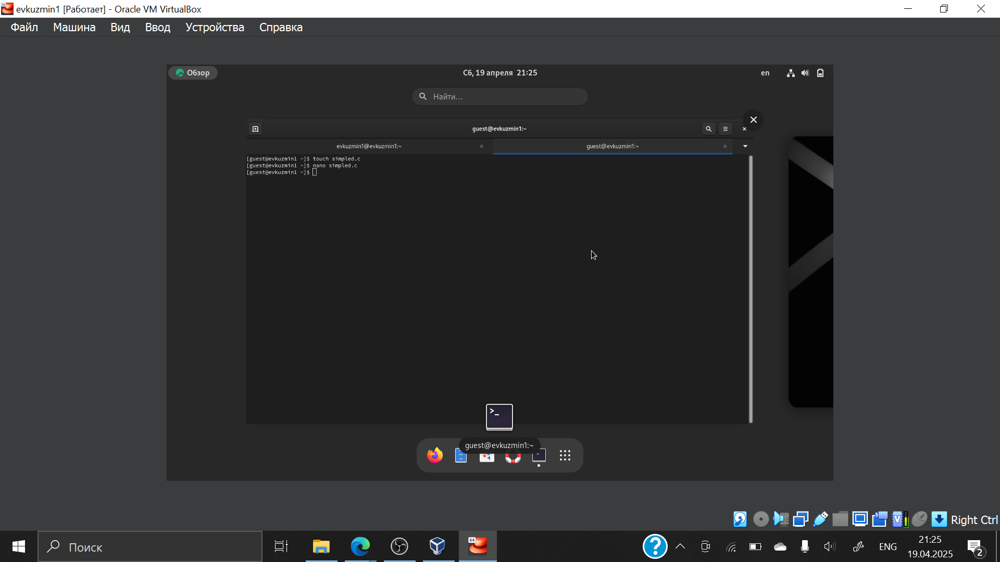{#fig:003 width=70%}

## Выполнение лабораторной работы

Компилирую файл, проверяю, что он скомпилировался 

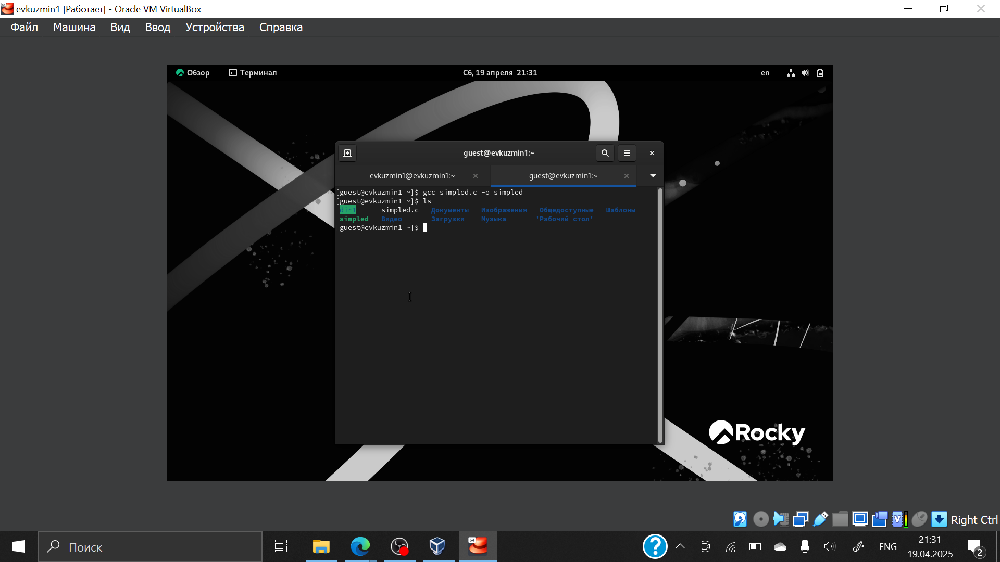{#fig:005 width=70%}

## Выполнение лабораторной работы

Запускаю исполняемый файл. В выводе файла выписыны номера пользоватея и групп, от вывода при вводе if, они отличаются только тем, что информации меньше 

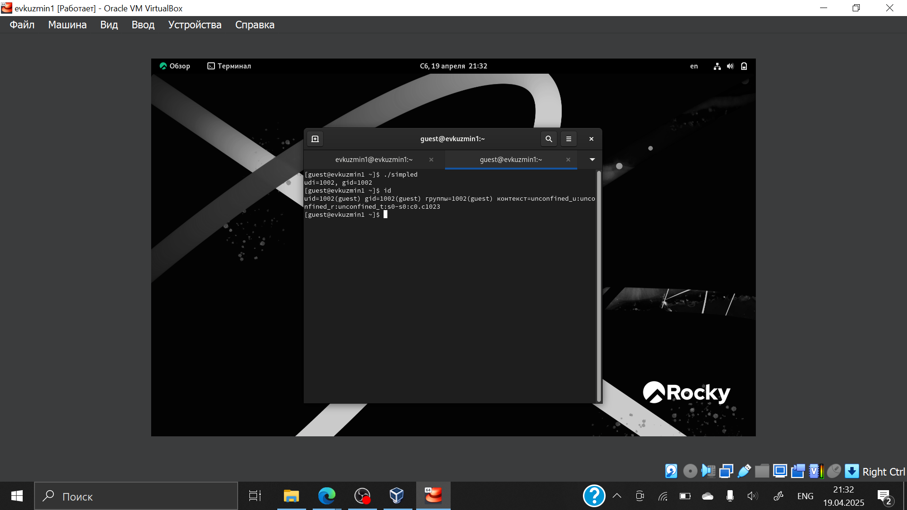{#fig:006 width=70%}

## Выполнение лабораторной работы

Создание, запись в файл и компиляция файла simpled2.c. Запуск программы 

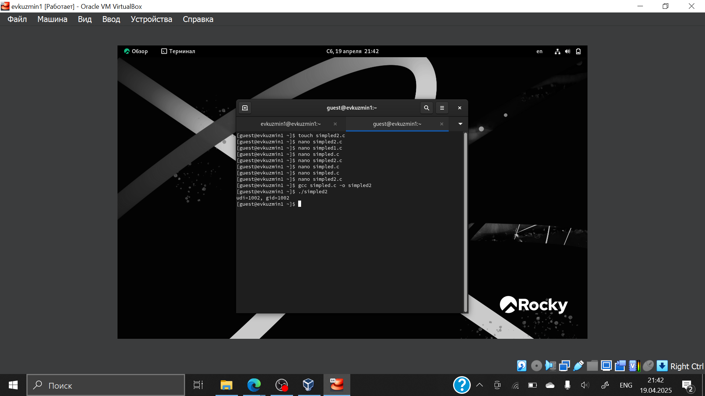{#fig:007 width=70%}

## Выполнение лабораторной работы

С помощью chown изменяю владельца файла на суперпользователя, с помощью chmod изменяю права доступа 

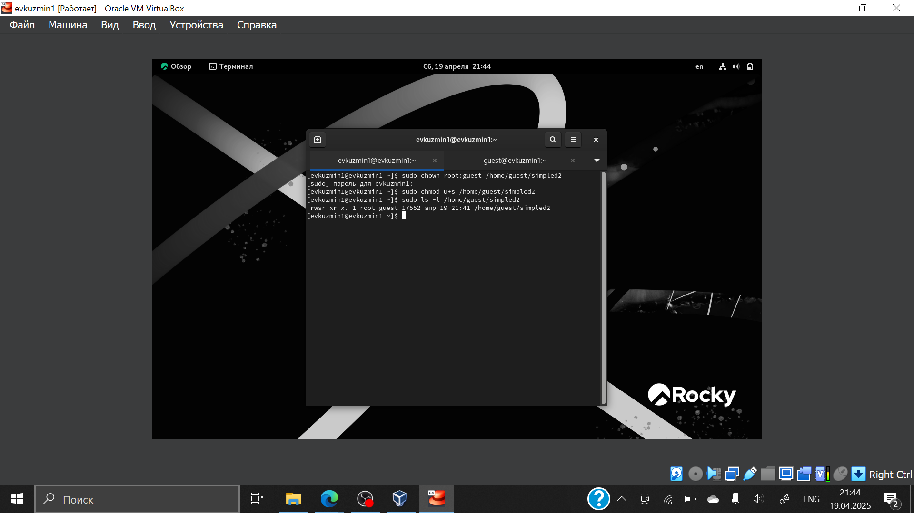{#fig:009 width=70%}

## Выполнение лабораторной работы

Сравнение вывода программы и команды id, наша команда снова вывела только ограниченное количество информации

{#fig:010 width=70%}

## Выполнение лабораторной работы

Проверяем папку tmp на наличие атрибута Sticky, т.к. в выводе есть буква t, то атрибут установлен 

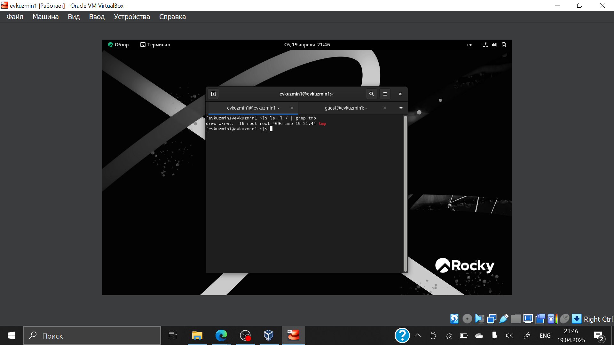{#fig:018 width=70%}

## Выполнение лабораторной работы

От имени пользователя guest создаю файл с текстом, добавляю права на чтение и запись для других пользователей 

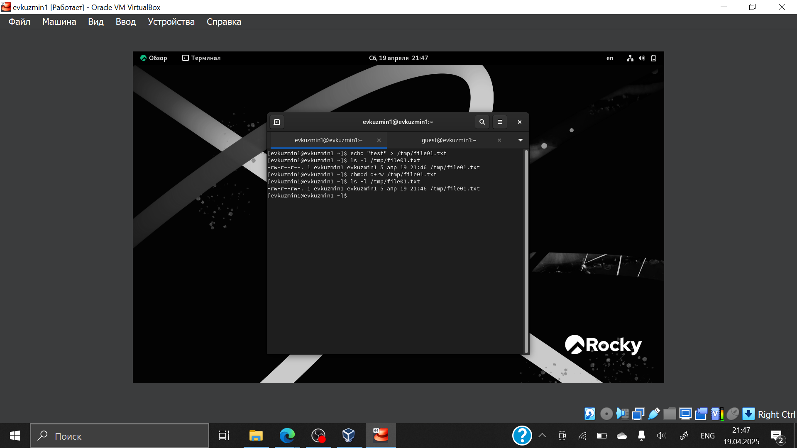{#fig:019 width=70%}

## Выполнение лабораторной работы

Вхожу в систему от имени пользователя guest2, от его имени могу прочитать файл file01.txt

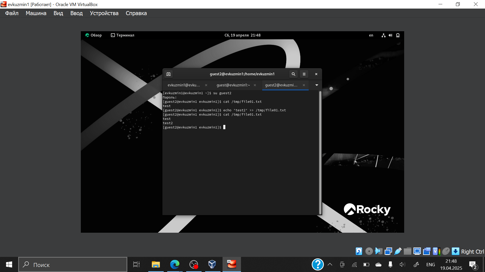{#fig:020 width=70%}

## Выполнение лабораторной работы

Также возможно добавить в файл file01.txt новую информацию от имени пользователя guest2

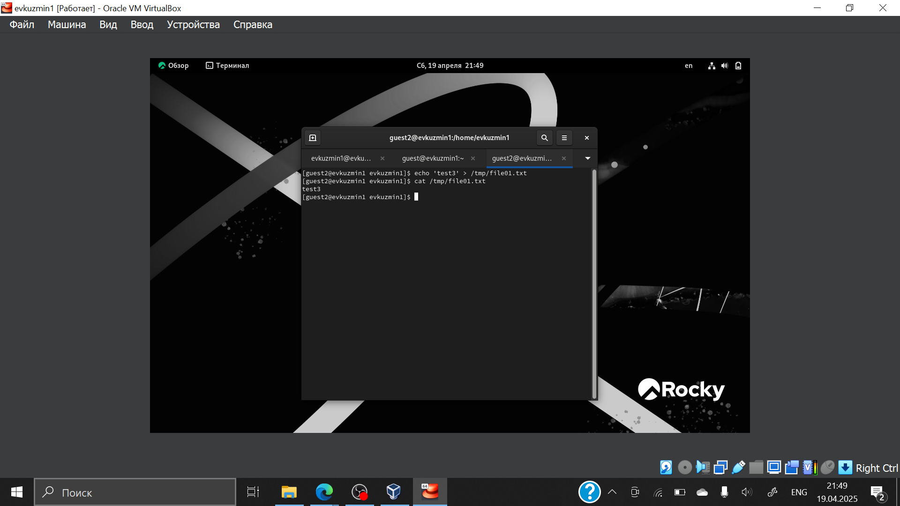{#fig:021 width=70%}

## Выполнение лабораторной работы

Далее пробуем удалить файл 

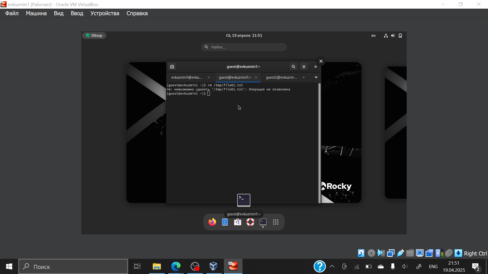{#fig:022 width=70%}

## Выполнение лабораторной работы

От имени суперпользователя снимаем с директории атрибут Sticky 

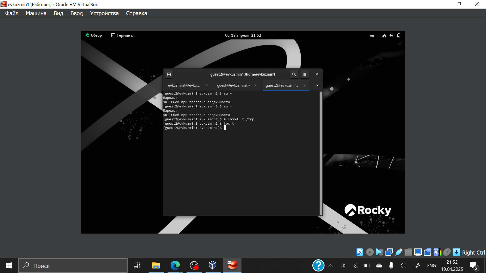{#fig:023 width=70%}

## Вывод

Я изучил механизм изменения идентификаторов, применив
SetUID- и Sticky-биты. Я получил требуемые практические навыки работы в консоли с дополнительными атрибутами, рассмотрев работы механизма
смены идентификатора процессов пользователей, а также влияние бита
Sticky на запись и удаление файлов.

:::

