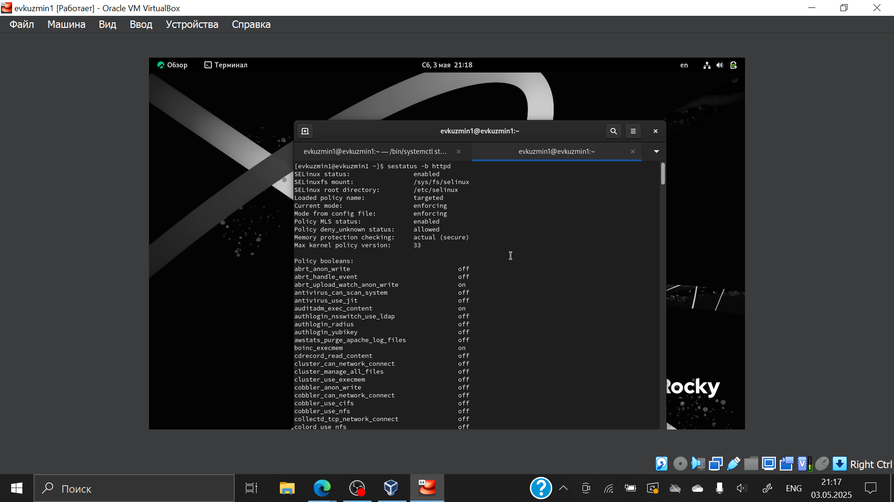
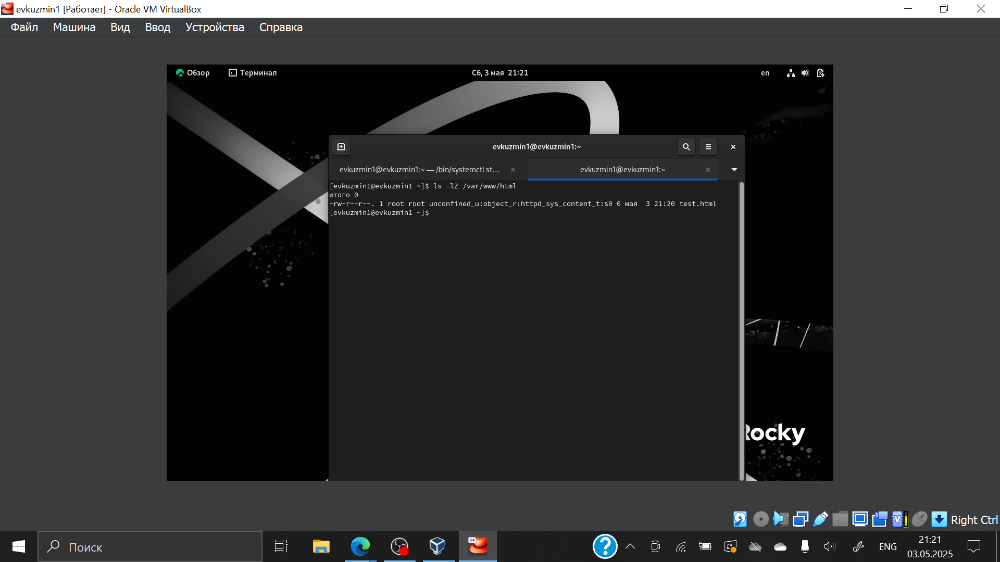
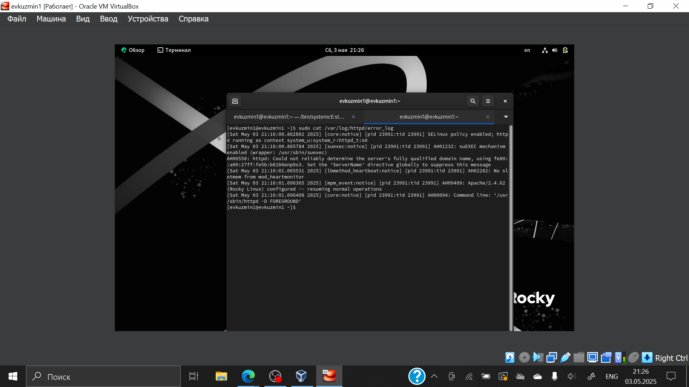

---
## Front matter
lang: ru-RU
title: Презентация по лабораторной работе №6
subtitle: Основы информационной безопасности
author:
  - Кузьмин Егор Витальевич
institute:
  - Российский университет дружбы народов, Москва, Россия
date: 5 мая 2025

## i18n babel
babel-lang: russian
babel-otherlangs: english

## Fonts
mainfont: PT Serif
romanfont: PT Serif
sansfont: PT Sans
monofont: PT Mono
mainfontoptions: Ligatures=TeX
romanfontoptions: Ligatures=TeX
sansfontoptions: Ligatures=TeX,Scale=MatchLowercase
monofontoptions: Scale=MatchLowercase,Scale=0.9

## Formatting pdf
toc: false
toc-title: Содержание
slide_level: 2
aspectratio: 169
section-titles: true
theme: metropolis
header-includes:
 - \metroset{progressbar=frametitle,sectionpage=progressbar,numbering=fraction}
 - '\makeatletter'
 - '\beamer@ignorenonframefalse'
 - '\makeatother'
---

# Информация

## Докладчик

  * Кузьмин Егор Витальевич
  * студент группы НКАбд-01-23
  * Российский университет дружбы народов

## Цель

Развить навыки администрирования ОС Linux. Получить первое практическое знакомство с технологией SELinux1. Проверить работу SELinx на практике совместно с веб-сервером
Apache.

# Выполнение лабораторной работы

## Выполнение лабораторной работы

 SELinux работает в режиме enforcing политики targeted с помощью команд getenforce и sestatus

{#fig:001 width=70%}

## Выполнение лабораторной работы

Запускаю сервер apache, далее обращаюсь с помощью браузера к веб-серверу, запущенному на компьютере, он работает, что видно из вывода команды `service httpd status`

{#fig:002 width=70%}

## Выполнение лабораторной работы

С помощью команды `ps auxZ | grep httpd` нахожу веб-сервер Apache в списке процессов. 

{#fig:003 width=70%}

## Выполнение лабораторной работы

Просмотриваю текущее состояние переключателей SELinux для Apache с помощью команды `sestatus -bigrep httpd` 

{#fig:004 width=70%}

## Выполнение лабораторной работы

Просмотриваю статистику по политике с помощью команды `seinfo`. Множество пользователей - 8, ролей - 39, типов - 5135. 

{#fig:005 width=70%}

## Выполнение лабораторной работы

Типы поддиректорий, находящихся в директории `/var/www`, с помощью команды `ls -lZ /var/www` следующие: владелец - root, права на изменения только у владельца. Файлов в директории нет 

{#fig:006 width=70%}

## Выполнение лабораторной работы

Создать файл может только суперпользователь, поэтому от его имени создаем файл touch.html cо следующим содержанием:

{#fig:008 width=70%}

## Выполнение лабораторной работы

Проверяю контекст созданного файла. По умолчанию это httpd_sys_content_t 

{#fig:009 width=70%}

## Выполнение лабораторной работы

Изменяю контекст файла на любой другой, к которому процесс httpd не
должен иметь доступа, например, `на samba_share_t`:
`chcon -t samba_share_t /var/www/html/test.html`
`ls -Z /var/www/html/test.html`
Контекст действительно поменялся 

{#fig:011 width=70%}

## Выполнение лабораторной работы

При попытке отображения файла в браузере получаем сообщение об ошибке 
файл не был отображён, хотя права
доступа позволяют читать этот файл любому пользователю, потому что установлен контекст, к которому процесс httpd не должен иметь доступа.

{#fig:012 width=70%}

## Выполнение лабораторной работы

Просмотрите файлы `/var/log/http/error_log`,
`/var/log/http/access_log` и `/var/log/audit/audit.log` и
выясните, в каких файлах появились записи. Запись появилась в файлу error_log 

{#fig:014 width=70%}

## Выполнение лабораторной работы

Выполняю команду
`semanage port -a -t http_port_t -р tcp 81`
После этого проверяю список портов командой
`semanage port -l | grep http_port_t`
Порт 81 появился в списке

{#fig:015 width=70%}

## Выполнение лабораторной работы

Перезапускаю сервер Apache 

{#fig:016 width=70%}

## Выполнение лабораторной работы

Возвращаю в файле /etc/httpd/httpd.conf порт 80, вместо 81.Далее удаляю файл test.html, проверяю, что он удален

{#fig:017 width=70%}

## Вывод

В ходе выполнения данной лабораторной работы были развиты навыки администрирования ОС Linux, получено первое практическое знакомство с технологией SELinux и проверена работа SELinux на практике совместно с веб-сервером
Apache.

:::

