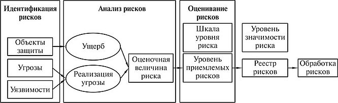
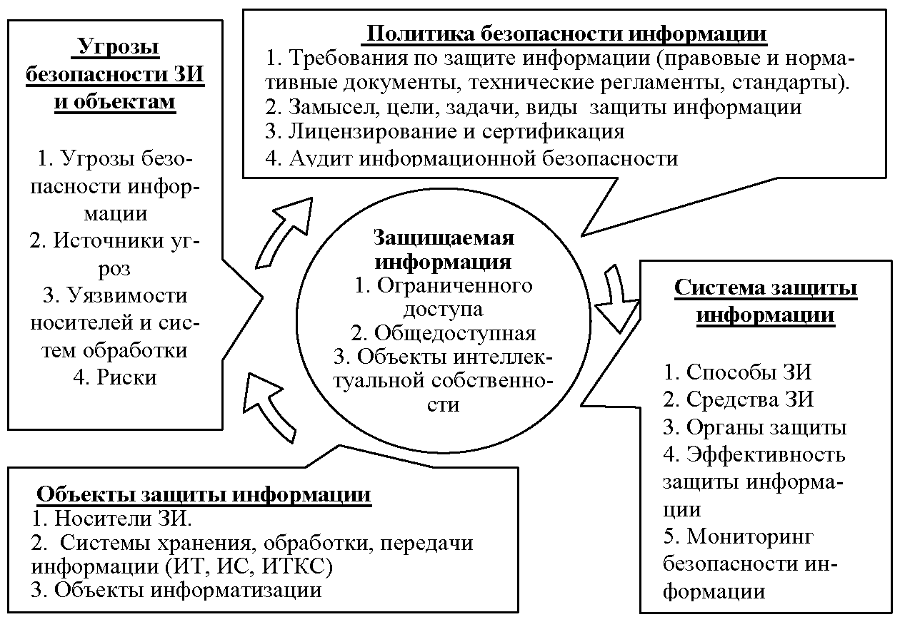
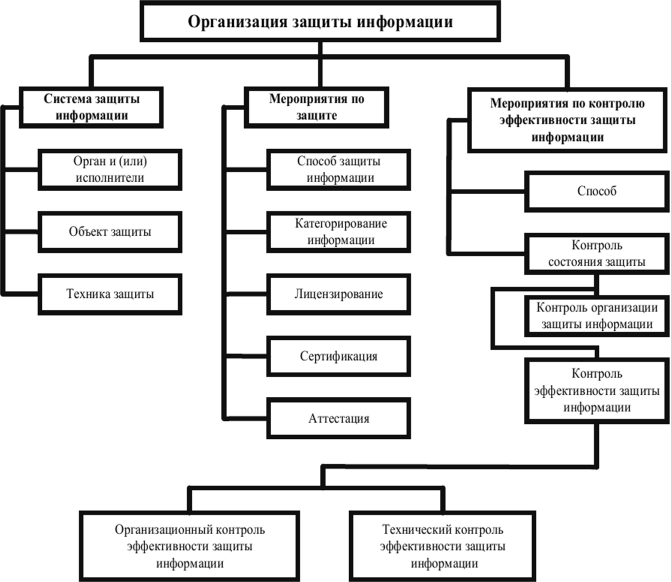

---
## Front matter
lang: ru-RU
title: Создание и функции службы информационной безопасности на предприятии
subtitle: Основы информационной безопасности
author:
  - Кузьмин Егор Витальевич, НКАбд-01-23
institute:
  - Российский университет дружбы народов, Москва, Россия
date: 02 апреля 2025

## Fonts
mainfont: PT Serif
romanfont: PT Serif
sansfont: PT Sans
monofont: PT Mono
mainfontoptions: Ligatures=TeX
romanfontoptions: Ligatures=TeX
sansfontoptions: Ligatures=TeX,Scale=MatchLowercase
monofontoptions: Scale=MatchLowercase,Scale=0.9

## i18n babel
babel-lang: russian
babel-otherlangs: english

## Formatting pdf
toc: false
toc-title: Содержание
slide_level: 2
aspectratio: 169
section-titles: true
theme: metropolis
header-includes:
 - \metroset{progressbar=frametitle,sectionpage=progressbar,numbering=fraction}
 - '\makeatletter'
 - '\beamer@ignorenonframefalse'
 - '\makeatother'
---

## Докладчик

  * Кузьмин Егор Витальевич
  * НКАбд-01-23
  * Российский университет дружбы народов

## Введение

В рамках изучения дисциплины «Основы информационной безопасности» в этом проекте рассматривается создание службы безопасности предприятия исключительно в контексте защиты информации. В отличие от комплексных служб, охватывающих физическую охрану, кадровый контроль и технику безопасности, акцент сделан именно на цифровую защиту, управление рисками и соблюдение нормативов в области информационной безопасности.

## Роль службы

Службы информационной безопасности — это не просто ИТ-подразделение, а стратегическая структура, которая проектирует, внедряет и развивает систему защиты информации. Она охватывает не только цифровые системы, но и процессы управления, организационные процедуры, юридические аспекты и человеческий фактор. Основная задача службы — не реагировать на инциденты, а предвидеть угрозы, снижать уязвимости и обеспечивать устойчивость бизнес-процессов.

## Этапы создания 

- Анализ информационных активов и рисков
- Разработка политики безопасности
- Формирование структуры службы и внедрение технических и организационных мер. 
- Обучение персонала и запуск систем мониторинга.
- Каждый из этапов должен быть документирован, согласован с руководством и адаптирован к специфике организации.

## Анализ рисков и активов

Анализ начинается с выявления информационных ресурсов предприятия: баз данных, сервисов, персональных и коммерческих данных. Затем определяется, какие угрозы могут повлиять на безопасность этих активов — от вредоносного ПО до действий сотрудников.

## Политика информационной безопасности

Политика ИБ — это главный нормативный документ, в котором определены цели, подходы и правила защиты информации. Она регулирует ответственность руководства и сотрудников, порядок доступа к данным, действия при инцидентах и структуру внутреннего контроля.

## Структура службы

В зависимости от масштаба организации структура может быть компактной или разветвлённой. В неё обычно входят руководитель службы (CISO), аналитики, инженеры, аудиторы и специалисты по обучению. В крупных компаниях создаются полноценные SOC (центры мониторинга). Эффективность работы службы зависит от её взаимодействия с ИТ-отделом, юристами, кадровиками и руководством.

## Техническая и процессная защита

Служба ИБ внедряет такие инструменты, как системы обнаружения атак, предотвращения утечек данных, SIEM-платформы, многофакторную аутентификацию и средства резервного копирования. 

## Международные и российские стандарты

Служба ИБ обеспечивает соблюдение нормативов: ISO/IEC 27001 (управление ИБ), ISO/IEC 27005 (оценка рисков), PCI DSS (защита платёжных данных), ФЗ-152 (персональные данные в РФ), GDPR (персональные данные граждан ЕС). Эти стандарты определяют требования к защите данных, структуре процессов, отчётности и ответственности. Их выполнение становится обязательным условием работы с клиентами, особенно зарубежными. Около 80% инцидентов связаны с действиями сотрудников. Цель — повысить осознанность и вовлечённость персонала в защиту информации. 

## Заключение

Служба информационной безопасности — это не вспомогательное подразделение, а система, управляющая рисками и цифровой устойчивостью компании. Её роль выходит за рамки технологий — она обеспечивает доверие, соответствие стандартам, защиту репутации и стабильность бизнеса. В современном мире ни одно предприятие не может быть надёжным без нее.

## Итог

- Спасибо за внимание!

