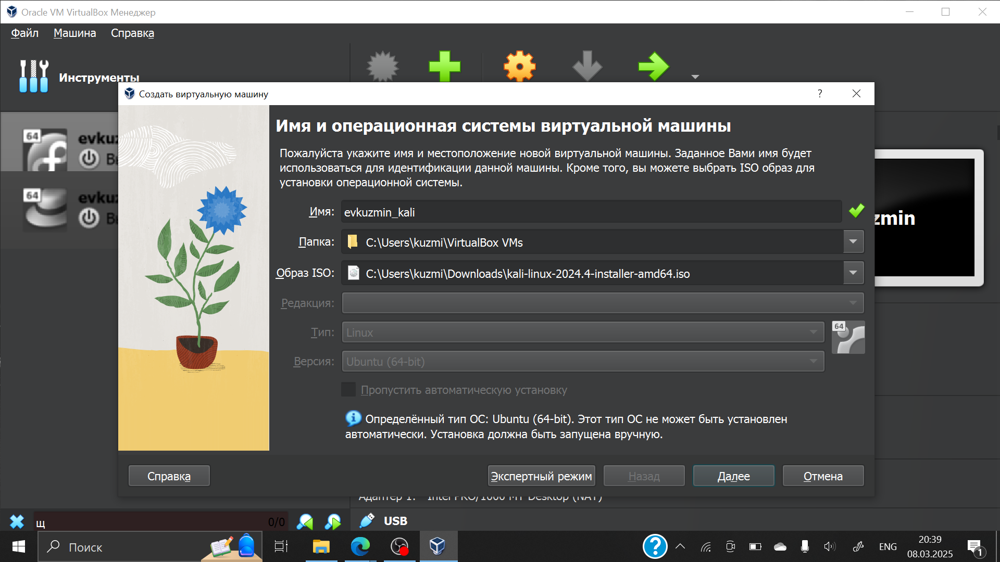
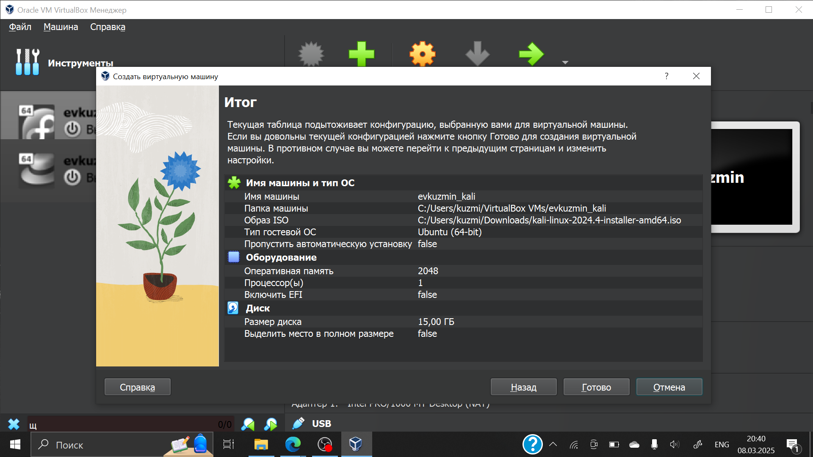
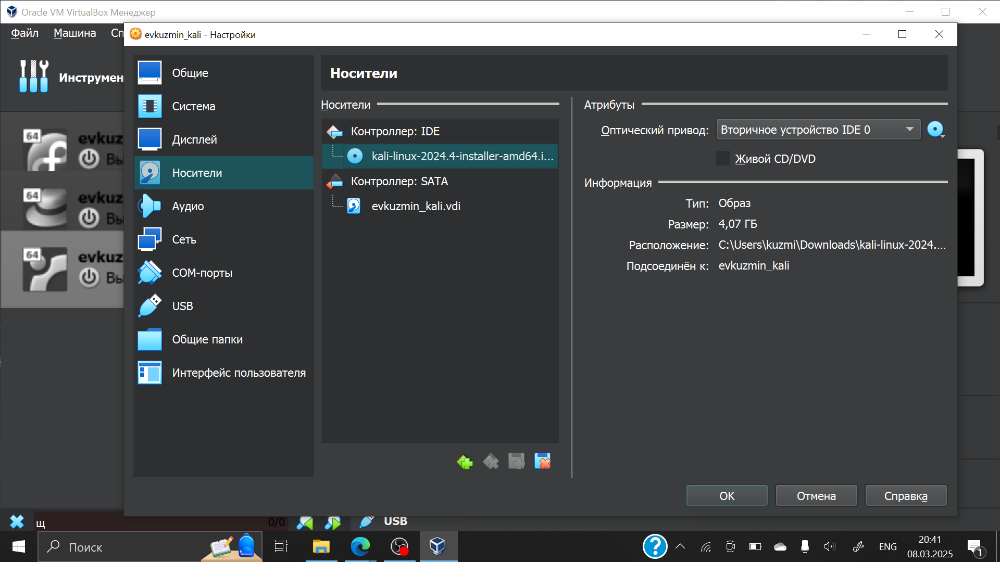
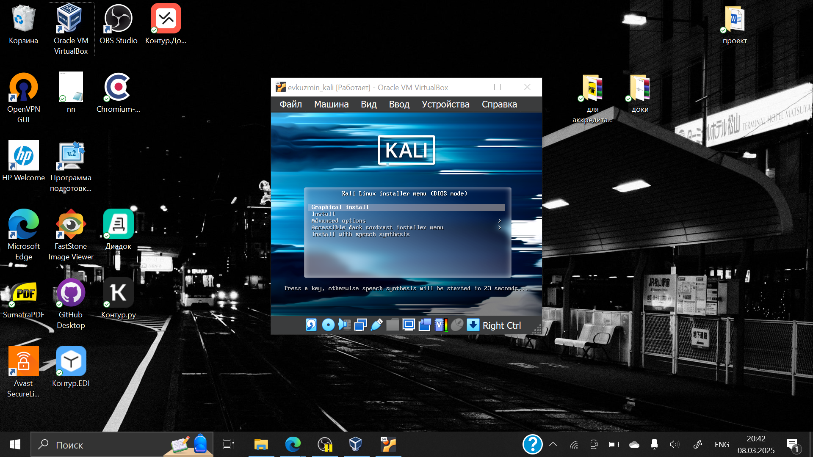
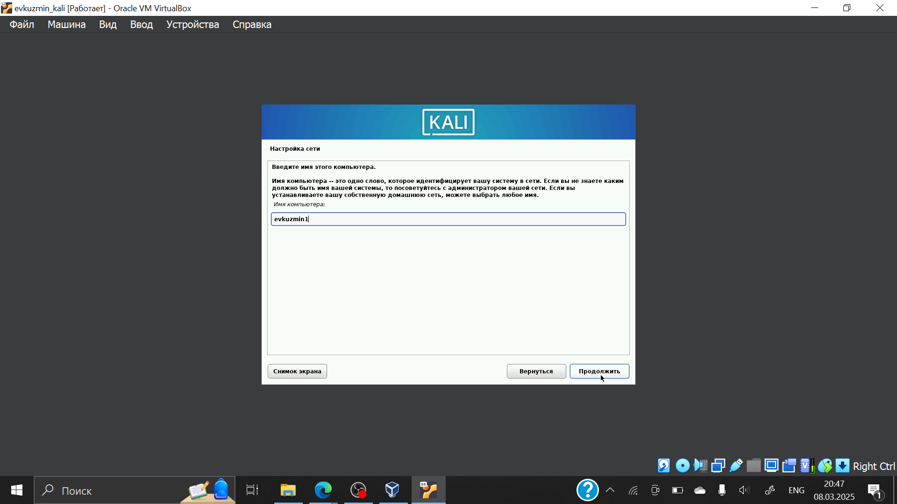
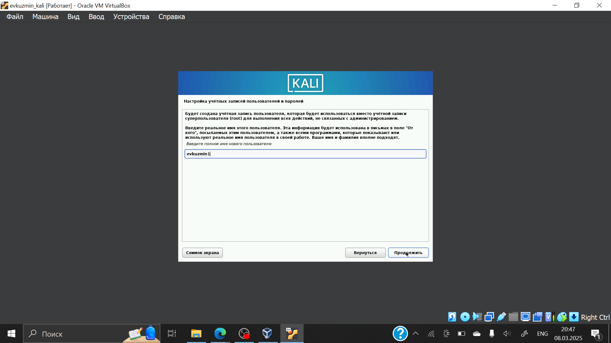
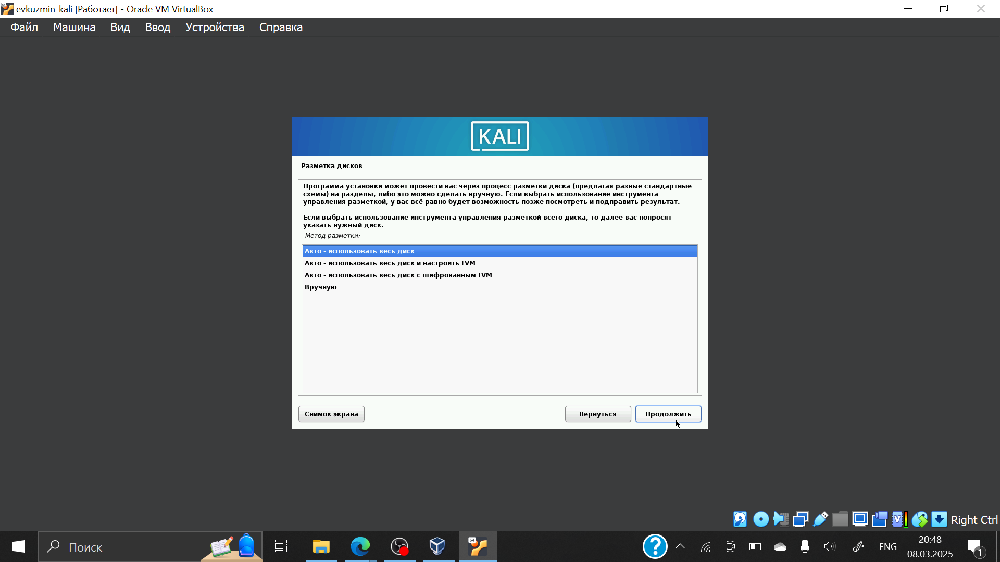
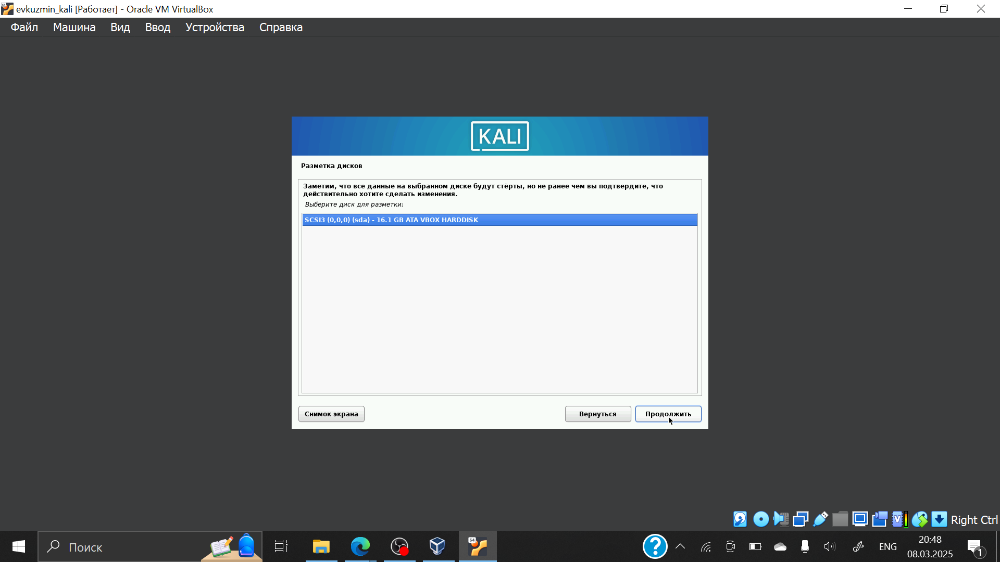
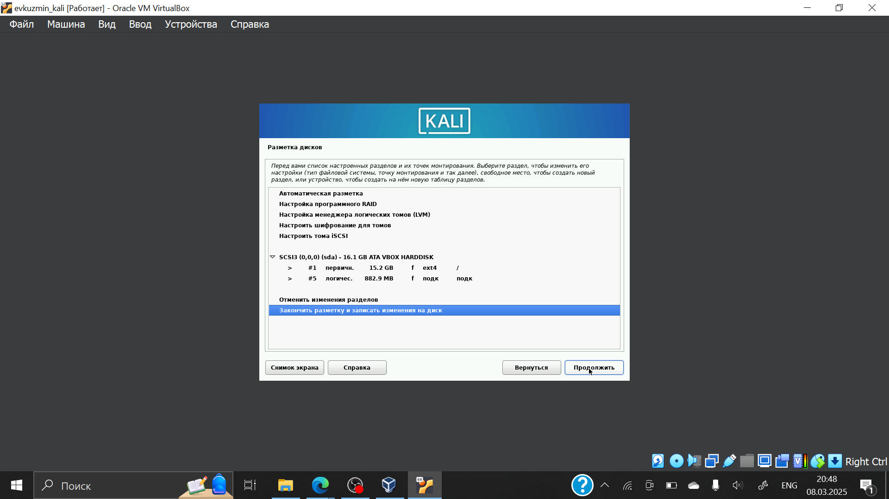
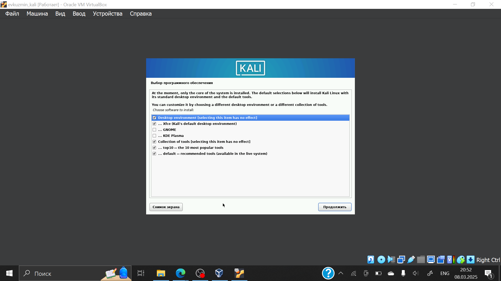

---
## Front matter
lang: ru-RU
title: Презентация по выполнению индивидуального проекта №1
subtitle: Основы информационной безопасности
author:
  - Кузьмин Егор Витальевич
institute:
  - Российский университет дружбы народов, Москва, Россия
date: 2 марта 2024

## i18n babel
babel-lang: russian
babel-otherlangs: english

## Fonts
mainfont: PT Serif
romanfont: PT Serif
sansfont: PT Sans
monofont: PT Mono
mainfontoptions: Ligatures=TeX
romanfontoptions: Ligatures=TeX
sansfontoptions: Ligatures=TeX,Scale=MatchLowercase
monofontoptions: Scale=MatchLowercase,Scale=0.9

## Formatting pdf
toc: false
toc-title: Содержание
slide_level: 2
aspectratio: 169
section-titles: true
theme: metropolis
header-includes:
 - \metroset{progressbar=frametitle,sectionpage=progressbar,numbering=fraction}
 - '\makeatletter'
 - '\beamer@ignorenonframefalse'
 - '\makeatother'
---

# Информация

## Докладчик

:::::::::::::: {.columns align=center}
::: {.column width="70%"}

  - Кузьмин Егор Витальевич
  - НКАбд-01-23
  - Российский университет дружбы народов

## Цель

Приобретение практических навыков по установке операционной системы Linux на виртуальную машину.

- Необходимо установить дистрибутив Kali Linux на виртуальную машину VirtualBox.

# Выполнение первого этапа проекта

## Создание виртуальной машины

Открываю VirtualBox, нажимаю создать, в появившемся окне выбираю тип операционной системы Linux, версия - Debian, задаю имя машины (рис. 1).

{#fig:001 width=70%}

## Создание виртуальной машины

Соглашаюсь с получившимися характеристиками, продолжаю (рис. 4).

{#fig:004 width=70%}

## Создание виртуальной машины

Проверю подключенный ранее скачанный образ диска 

{#fig:005 width=70%}

## Установка операционной системы на виртуальную машину

В окне установки Kali выбираю графическую установку 

{#fig:006 width=70%}

## Настройка имени компьютера

Ввожу имя компьютера 

{#fig:011 width=70%}

## Настройка пользователей

Ввожу имя пользователя, у которой будут права суперпользователя (рис. 13).

{#fig:013 width=70%}

## Разметка дисков

Теперь установщик проверяет диски и предлагает различные варианты,
в зависимости от настроек. Созданный виртуальный диск чистый, поэтому
я выбираю «весь диск» 

{#fig:017 width=70%}

## Разметка дисков

Убеждаюсь, что выбран нужный виртуальный диск, продолжаю
настройку разметки дисков 

{#fig:018 width=70%}

## Разметка дисков

После этого этапа надо подтвердить
окончание разметки дисков, чтобы изменения были записаны 

{#fig:020 width=70%}

## Установка метапакетов

Далее я могу выбрать, какие пакеты установить. Выбор по
умолчанию установить стандартную систему Kali Linux, нам подходит

{#fig:022 width=70%}

## Вывод

Я приобрел практические навыки по установке операционной системы Linux на виртуальную машину, установив дистрибутив Kali LInux на VirtualBox.

:::

